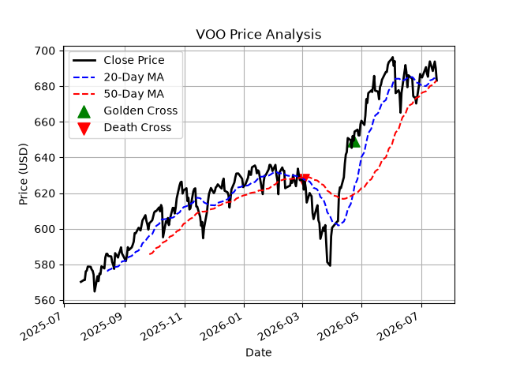

# ETF Portfolio Analyzer

A Python project that analyzes ETF performance using historical market data and visualizes key technical indicators.

## Overview
This project downloads historical ETF price data, calculates key performance, and technical analysis metrics. Including daily returns, annual volatility, maximum drawdown, moving averages, and Golden/Death Cross signals. The results are displayed both as summary statistics and a visualization.

## Features

- Download historical ETF data using yfinance
- Calculate daily return
- Calculate annual volatility
- Calculate maximum drawdown (MDD)
- Compute 20-day and 50-day moving averages
- Detect Golden Cross and Death Cross
- Visualize price trends and technical indicators

## Example


## Installation

```bash
pip install -r requirements.txt
```

## Usage

```bash
python src/main.py
```

## Technologies 

- Python
- Pandas
- Matplotlib
- yfinance
- Git
- GitHub

## Future Improvements

- Support multiple ETF tickers
- Compare multiple ETFs
- Calculate Sharpe Ratio
- Generate PDF reports
- Add a graphical user interface (GUI)

## Known Issues

On some Windows 11 systems with Smart App Control enabled,
Matplotlib may be blocked by Windows Code Integrity.
As a workaround, the matplotlib import is deferred until `plot_chart()` is called.